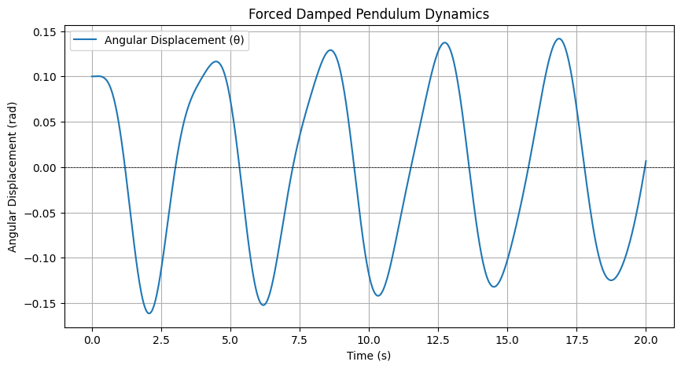

# Problem 2

# Investigating the Dynamics of a Forced Damped Pendulum

## 1. Theoretical Foundation

### Governing Differential Equation

The motion of a forced damped pendulum can be expressed by the following second-order differential equation:

\[
\frac{d^2\theta}{dt^2} + 2\beta \frac{d\theta}{dt} + \frac{g}{L} \sin(\theta) = A \cos(\omega t)
\]

where:
- \( \theta \) is the angular displacement,
- \( g \) is the acceleration due to gravity,
- \( L \) is the length of the pendulum,
- \( \beta \) is the damping coefficient,
- \( A \) is the amplitude of the external driving force,
- \( \omega \) is the angular frequency of the driving force.

For small-angle oscillations, we can use the approximation \( \sin(\theta) \approx \theta \), simplifying the equation to:

\[
\frac{d^2\theta}{dt^2} + 2\beta \frac{d\theta}{dt} + \frac{g}{L} \theta = A \cos(\omega t)
\]

### Approximate Solutions for Small-Angle Oscillations

The above equation can be solved by using the method of undetermined coefficients or Laplace transforms. The general solution can be expressed as a sum of the homogeneous solution and a particular solution:

\[
\theta(t) = \theta_h(t) + \theta_p(t)
\]

1. **Homogeneous Solution** \( \theta_h(t) \):
   The homogeneous part (ignoring the driving force) describes the damped oscillation:

   \[
   \theta_h(t) = e^{-\beta t}(C_1 \cos(\omega_0 t) + C_2 \sin(\omega_0 t))
   \]

   where \( \omega_0 = \sqrt{\frac{g}{L}} \) is the natural frequency of the pendulum.

2. **Particular Solution** \( \theta_p(t) \):
   For the steady-state response to the external force, assuming a solution of the form:

   \[
   \theta_p(t) = B \cos(\omega t + \phi)
   \]

   We can substitute this into the differential equation to find \( B \) and \( \phi \):

   \[
   B = \frac{A}{\sqrt{(\frac{g}{L} - \omega^2)^2 + (2\beta \omega)^2}}
   \]

   Resonance occurs when the driving frequency \( \omega \) approaches the natural frequency \( \omega_0 \). At resonance, the amplitude of oscillation can become significantly larger, leading to increased energy absorption by the system.

### Resonance Conditions and Implications

The resonance condition can be quantitatively analyzed by examining how the amplitude \( B \) behaves as a function of \( \omega \) and identifying where \( B \) reaches its maximum. A sharp peak near \( \omega \approx \omega_0 \) indicates resonance, where a small change in driving frequency can lead to a large change in amplitude.

## 2. Analysis of Dynamics

### Influence of Damping Coefficient, Driving Amplitude, and Frequency

Investigating the dynamics involves varying the damping coefficient \( \beta \), driving amplitude \( A \), and frequency \( \omega \):

- **Effect of Damping**: Higher damping results in reduced amplitude and may lead to a quick stabilization of the motion compared to lightly damped systems, which may exhibit prolonged oscillations.
  
- **Effect of Driving Amplitude**: Increasing the driving amplitude tends to increase the amplitude of the steady-state oscillation, particularly near resonance.

- **Effect of Driving Frequency**: Varying \( \omega \) can lead to regular periodic motion or complex behaviors such as quasi-periodicity and chaos as \( \omega \) moves away from \( \omega_0 \).

### Transition Between Regular and Chaotic Motion

With increased driving amplitude and certain values of \( \omega \), the system may transition from periodic to chaotic motion. This can be analyzed using tools such as Lyapunov exponents or bifurcation diagrams.

#### Physical Interpretations

- **Regular Motion**: The pendulum oscillates in a stable pattern when driving frequencies are harmonically related to the natural frequency.
  
- **Chaotic Motion**: Irregular oscillations occur when there is enough energy in the system combined with non-linear effects, such as when the frequency is varied rapidly around resonance.

## 3. Practical Applications

The forced damped pendulum model applies in various real-world scenarios:

- **Energy Harvesting Devices**: Systems that convert mechanical energy from vibrations into usable electrical energy.
  
- **Suspension Bridges**: Understanding how dynamic forces act on bridge structures to prevent resonance-related disasters.
  
- **Oscillating Circuits**: Models in electrical engineering that treat inductors and capacitors as driven damped systems.

## 4. Implementation

### Python Simulation Code

The following Python script simulates the motion of a forced damped pendulum and visualizes its behavior under various conditions.

### Graphical Representations

### Limitations and Extensions

This basic model assumes linear damping and periodic forcing. Potential extensions may include:

- **Nonlinear Damping**: Incorporating effects of damping that depends on displacement or velocity.
- **Non-Periodic Driving Forces**: Examining aperiodic or impulsive forces to study their effects on the dynamical behavior.

### Phase Portraits, Poincaré Sections, and Bifurcation Diagrams

These tools help analyze transitions to chaotic dynamics:
- **Phase Portraits** exhibit trajectories in the phase space (angular displacement vs. angular velocity).
- **Poincaré Sections** can reveal stable and unstable periodic orbits by plotting intersections of trajectories.
- **Bifurcation Diagrams** visualize how the long-term behavior of the system changes as parameters like the driving frequency or amplitude are varied.

## Conclusion

The dynamics of a forced damped pendulum beautifully illustrates complex behaviors stemming from fundamental physical principles. By effectively simulating the system, one can deepen the understanding of oscillatory phenomena, with real-world implications across multiple engineering and science disciplines.