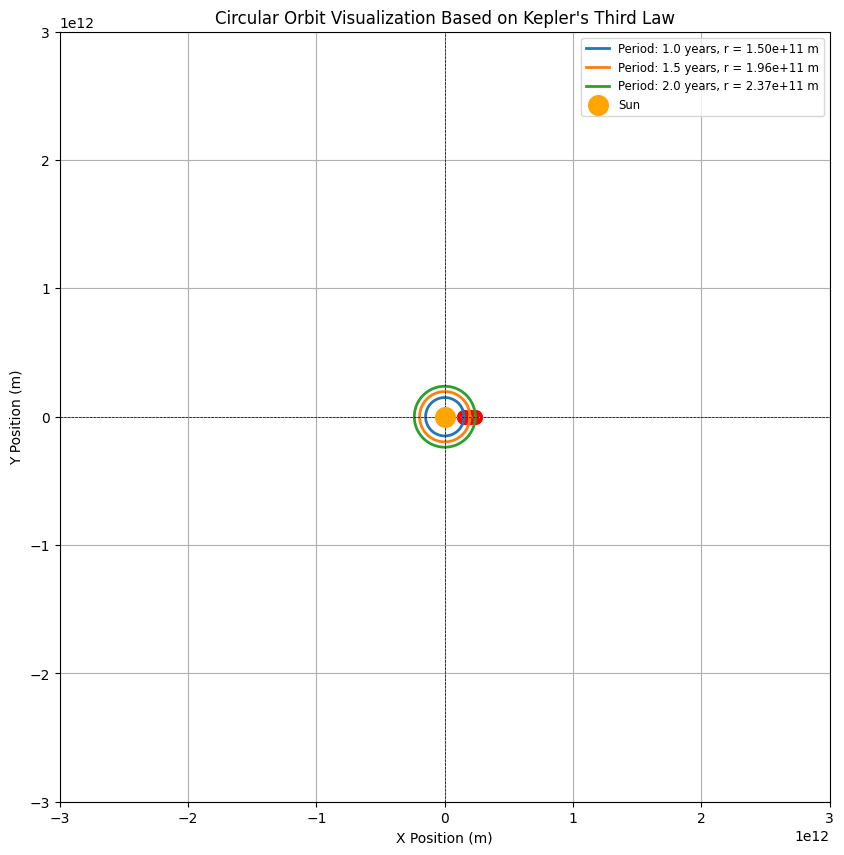

# Problem 1

# Orbital Period and Orbital Radius

## Motivation

The relationship between the square of the orbital period and the cube of the orbital radius, known as **Kepler's Third Law**, is a fundamental principle in celestial mechanics. This relationship allows astronomers and physicists to understand and predict the motions of celestial bodies, including planets, moons, and artificial satellites. By analyzing this relationship, we can connect fundamental principles of gravity with real-world phenomena, such as satellite orbits and planetary systems.

## Derivation of Kepler's Third Law

### Circular Orbits

For a small body in circular orbit around a larger mass, the gravitational force providing the necessary centripetal force can be written as:

$$
F = \frac{G M m}{r^2}
$$

where:
- \( F \) is the gravitational force,
- \( G \) is the gravitational constant (\(6.674 \times 10^{-11} \, \text{N m}^2/\text{kg}^2\)),
- \( M \) is the mass of the central body (e.g., the Earth),
- \( m \) is the mass of the orbiting body (e.g., the Moon),
- \( r \) is the orbital radius (distance from the center of the central body to the orbiting body).

The centripetal force required for circular motion is given by:

$$
F = \frac{m v^2}{r}
$$

Setting the two expressions for force equal gives:

$$
\frac{G M m}{r^2} = \frac{m v^2}{r}
$$

Dividing both sides by \( m \) (mass of the orbiting body) and rearranging yields:

$$
v^2 = \frac{G M}{r}
$$

The orbital period \( T \) of the orbiting body is related to its linear velocity \( v \) and the circumference of the circle:

$$
v = \frac{2 \pi r}{T}
$$

Substituting this expression for \( v \) into the previous equation:

$$
\left(\frac{2 \pi r}{T}\right)^2 = \frac{G M}{r}
$$

Expanding this equation leads to:

$$
\frac{4 \pi^2 r^2}{T^2} = \frac{G M}{r}
$$

Multiplying both sides by \( r \) yields:

$$
\frac{4 \pi^2 r^3}{T^2} = G M
$$

Rearranging gives us Kepler's Third Law:

$$
T^2 = \frac{4 \pi^2}{G M} r^3
$$

This shows that the square of the orbital period \( T^2 \) is directly proportional to the cube of the orbital radius \( r^3 \).

## Implications for Astronomy

### Calculation of Planetary Masses and Distances

1. **Mass Determination**: Kepler's Third Law allows astronomers to calculate the mass of a celestial body (like the Sun) by observing the orbits of its satellites. If the orbital parameters (radius and period) of a satellite are known, the mass of the central body can be found using:

   $$
   M = \frac{4 \pi^2 r^3}{G T^2}
   $$

2. **Distances in Space**: By observing the orbital periods and distances of planets, we can infer distances in astronomical units (AU) and construct models of our solar system.

### Real-World Examples

1. **The Moon's Orbit Around Earth**: The average orbital radius of the Moon is about \( 3.84 \times 10^8 \, \text{m} \) and its orbital period is approximately \( 27.3 \, \text{days} \). This adheres to Kepler's Third Law and allows us to understand the gravitational influence of Earth.

2. **Orbits of Planets in the Solar System**: Each planet orbits the Sun in a circular (or nearly circular) path, and their periods and distances can be used to calculate relative masses and demonstrate the harmony of the solar system.

## Implementation: Computational Model

A computational model can simulate circular orbits and verify the relationship \( T^2 \propto r^3 \). Below is a Python script that visualizes circular orbits and demonstrates this relationship.

## Graphical Representations

Visual representation of circular orbits for different orbital radii corresponding to their periods derived from Kepler's Third Law. 

## Extension to Elliptical Orbits

While Kepler's Third Law is derived for circular orbits, it is also applicable to elliptical orbits. According to Kepler's First Law, planets move in elliptical orbits with the Sun at one focus. The relationship still holds, where the semi-major axis \( a \) of the ellipse replaces the radius \( r \):

$$
T^2 = \frac{4 \pi^2}{G M} a^3
$$

This generalization allows for the prediction of various celestial bodies' behavior regardless of their orbital shape.

## Conclusion

Kepler's Third Law provides a profound insight into the nature of celestial mechanics, illustrating the harmony and predictability inherent in the motions of celestial bodies. Through simulation, we gain a profound understanding of this law and its applications in modern astronomy, from planetary motion to the cornerstone of orbital mechanics.