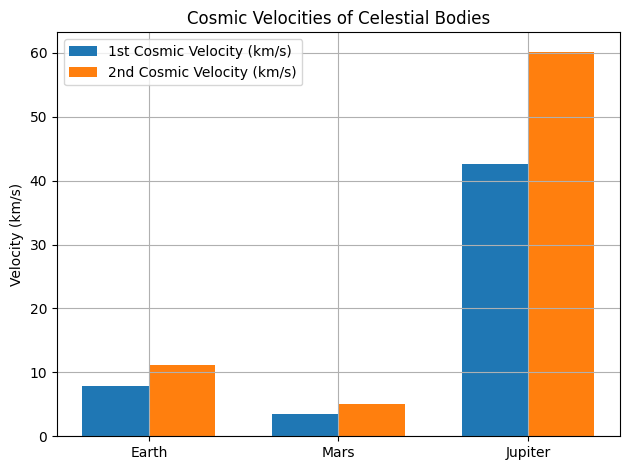
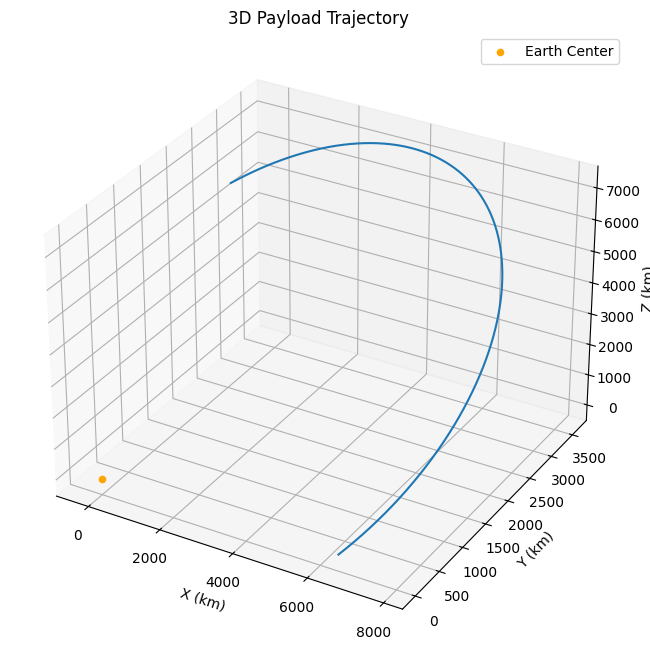
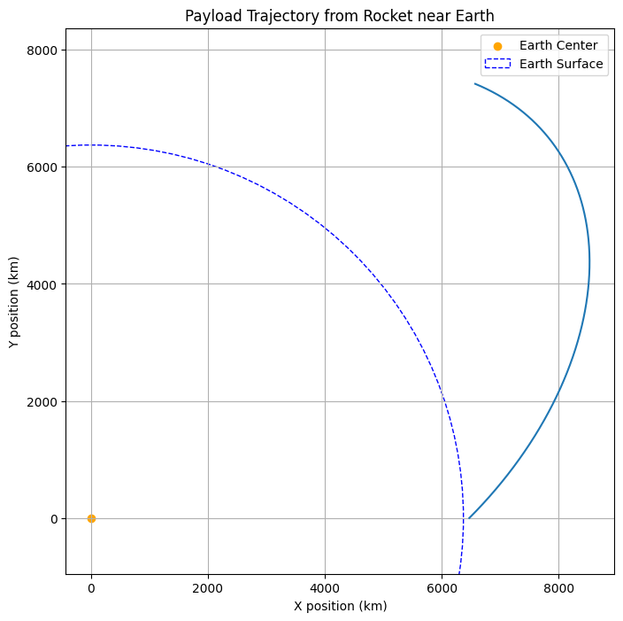

# Problem 2
# Escape Velocities and Cosmic Velocities

##  Motivation

Understanding the different levels of cosmic velocities is essential for space travel. These thresholds determine whether a spacecraft can orbit, escape a planet’s gravity, or leave a solar system. Mastering these concepts is foundational to planning satellite deployments, planetary missions, and interstellar exploration.

---

##  Definitions of Cosmic Velocities

### 🔹 First Cosmic Velocity (Orbital Velocity)

The velocity required to orbit a planet in a circular orbit just above the surface:

$$
v_1 = \sqrt{\frac{G M}{r}}
$$

### 🔹 Second Cosmic Velocity (Escape Velocity)

The velocity needed to escape the gravitational field of a planet without further propulsion:

$$
v_2 = \sqrt{2} \cdot v_1 = \sqrt{\frac{2 G M}{r}}
$$

### 🔹 Third Cosmic Velocity

The velocity required to escape the gravitational influence of a star (e.g., Sun) from a planet's orbit:

$$
v_3 = \sqrt{v^2_{\text{planet}} + v^2_{\text{escape from planet}}}
$$

or derived specifically depending on the system's configuration.

---

## 🧶 Mathematical Derivation and Parameters

* **$G$**: Gravitational constant $\approx 6.674 \times 10^{-11} \, \text{Nm}^2/\text{kg}^2$
* **$M$**: Mass of the celestial body
* **$r$**: Radius from the center of the celestial body

---

## 🌍 Comparative Calculations

We'll compute these velocities for:

* Earth
* Mars
* Jupiter

## 🚀 Third Cosmic Velocity Example

To compute third cosmic velocity from Earth’s orbit (to leave the Sun’s gravity):

$$
v_3 = \sqrt{\frac{2GM_{\odot}}{r_{\text{orbit}}}}
$$

Where $M_{\odot}$ is the Sun’s mass and $r_{\text{orbit}}$ is Earth’s orbital radius (\~1 AU).

---

## 🌠 Applications in Space Exploration

### 🚗 Satellite Launch

First cosmic velocity is essential for establishing orbit.

### 🌌 Planetary Missions

Second cosmic velocity needed to leave planet’s gravity and travel to other planets.

### 🌟 Interstellar Travel

Third cosmic velocity needed to break free from solar system—key for theoretical probes like Voyager or future missions to Alpha Centauri.

# Some visualizations
### 3D Trajectory Visualization (Advanced)
For a more comprehensive view, simulate the 3D trajectory and plot it.

