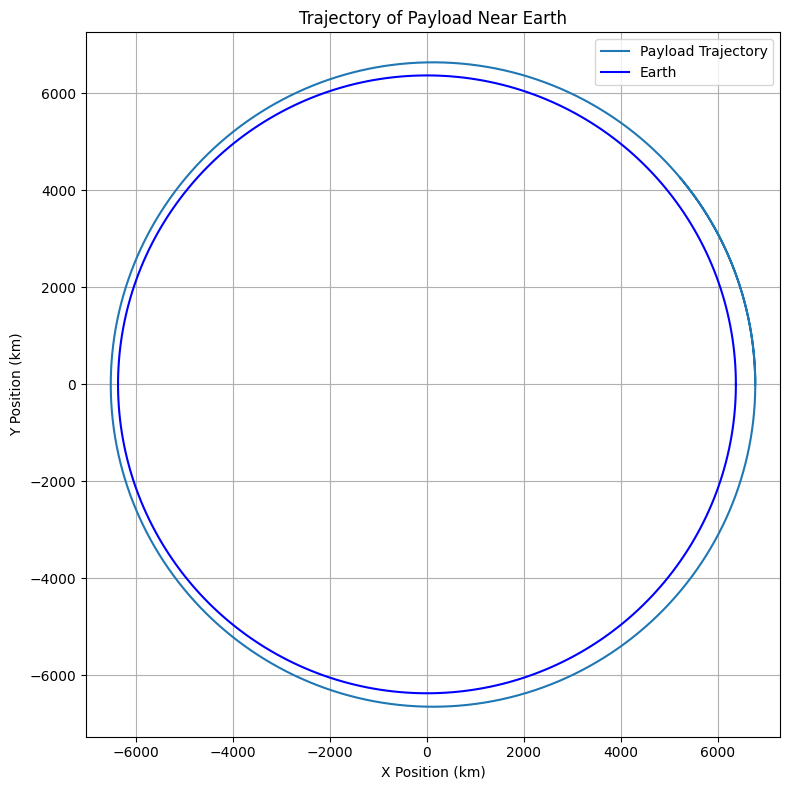

# Problem 3: Trajectories of a Freely Released Payload Near Earth

##  Motivation

When an object is released from a moving rocket near Earth, its trajectory depends on initial conditions and gravitational forces. This scenario presents a rich problem, blending principles of orbital mechanics and numerical methods. Understanding the potential trajectories is vital for space missions, such as deploying payloads or returning objects to Earth.

---

## ⚖️ Task Objectives

* Analyze the possible trajectories (e.g., parabolic, hyperbolic, elliptical) of a payload released near Earth.
* Perform a numerical analysis to compute the path of the payload based on given initial conditions (position, velocity, and altitude).
* Discuss how these trajectories relate to orbital insertion, reentry, or escape scenarios.
* Develop a computational tool to simulate and visualize the motion of the payload under Earth's gravity, accounting for initial velocities and directions.

---

## 🔄 Physical and Mathematical Background

We use Newton's Law of Gravitation:

$$
\vec{F} = -\frac{G M m}{r^2} \hat{r}
$$

and Newton's Second Law:

$$
\vec{F} = m \vec{a}
\Rightarrow \vec{a} = -\frac{G M}{r^2} \hat{r}
$$

We solve this using numerical integration (e.g., Runge-Kutta or Euler method).

---

Trajectory of Payload near Earth

3D Trajectory Visualization (Advanced)
For a more comprehensive view, simulate the 3D trajectory and plot it.

## 🚀 Analysis of Results

Depending on initial velocity and altitude:

* If velocity < orbital velocity: the object will fall back to Earth.
* If velocity = orbital velocity: the object will follow a circular orbit.
* If velocity > orbital but < escape: it will enter an elliptical orbit.
* If velocity = escape velocity: it will follow a parabolic trajectory.
* If velocity > escape velocity: hyperbolic escape.

---

## 🌌 Real-World Relevance

* **Satellite Deployment**: Accurate velocity ensures stable orbits.

* **Space Station Docking**: Predicting relative trajectories.
* **Reentry and Recovery**: Safe return paths for crew or payload.
* **Interplanetary Travel**: Planning escape trajectories and transfer orbits.

---

