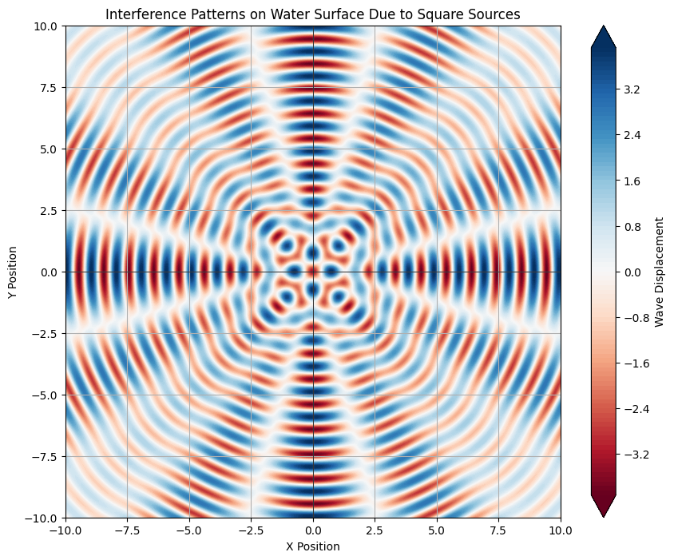

# Problem 1

# Interference Patterns on a Water Surface

## Motivation

Interference patterns occur when waves from different sources overlap, resulting in unique patterns on the surface of water. This phenomenon can vividly illustrate how waves combine, either reinforcing one another or canceling each other out. Studying these patterns allows us to visually understand wave behavior and explore fundamental concepts such as wave phase relationships and the impact of multiple sources. This task provides an engaging and hands-on approach to learning about wave interactions and their real-world applications.

## Problem Statement

In this task, we will analyze the interference patterns formed on a water surface due to the superposition of waves emitted from point sources located at the vertices of a chosen regular polygon. 

### Steps to Follow

1. **Select a Regular Polygon**: We will start with a square as our regular polygon.
2. **Position the Sources**: Place point wave sources at the vertices of the square.
3. **Wave Equations**: Write down the equations describing the waves emitted from each source.
4. **Superposition of Waves**: Apply the principle of superposition to sum the wave displacements across the water surface.
5. **Analyze Interference Patterns**: Evaluate the displacement function \( D(\mathbf{r}, t) \) as a function of position and time, identifying regions of constructive and destructive interference.
6. **Visualization**: Present graphical representations of the interference patterns.

### Mathematical Formulation

Let’s represent the wave emitted from each point source using the Single Disturbance equation. The displacement at position \( \mathbf{r} \) and time \( t \) from a point source can be described as:

\[
D(\mathbf{r}, t) = A \cos(k \cdot d + \omega t + \phi)
\]

where:
- \( D(\mathbf{r}, t) \) = displacement at position \( \mathbf{r} \) and time \( t \)
- \( A \) = amplitude of the wave
- \( k = \frac{2\pi}{\lambda} \) = wave number, related to the wavelength \( \lambda \)
- \( \omega = 2\pi f \) = angular frequency, related to the frequency \( f \)
- \( d \) = distance from the source to the observation point \( \mathbf{r} \)
- \( \phi \) = initial phase of the wave

### Superposition of Waves

For a regular polygon with \( N \) vertices, the total displacement at point \( \mathbf{r} \) at time \( t \) can be expressed as:

\[
D(\mathbf{r}, t) = \sum_{i=1}^{N} D_i(\mathbf{r}, t) = \sum_{i=1}^{N} A \cos(k \cdot d_i + \omega t + \phi_i)
\]

where \( D_i \) is the contribution from the \( i \)-th source.

## Analysis of Interference Patterns

1. **Constructive Interference**: This occurs where the waves from the sources align in phase, resulting in enhanced wave displacement. In the visualization, these regions may appear as areas of bright color, indicating maximum amplitudes.
  
2. **Destructive Interference**: This occurs where waves are out of phase (180 degrees apart), leading to cancellation of wave displacements. These regions will appear darker or neutral in the visualization.

## Graphical Representations

Contour plot illustrating the interference patterns formed by the waves emanating from the vertices of a square. The plot shows intricate patterns where the interference results in both constructive and destructive overlaps.

## Conclusion

Through this analysis and simulation, we have visualized the interference patterns resulting from multiple coherent wave sources arranged in a regular polygon. This exercise enhances our understanding of wave behavior and the principles of superposition, demonstrating how waves interact to create complex patterns in two-dimensional spaces. The techniques used here can be extended to more complex shapes and scenarios, providing a robust framework for exploring wave phenomena in various contexts.