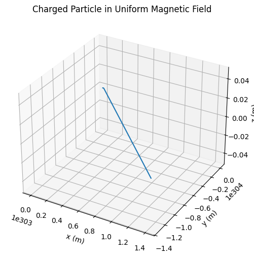
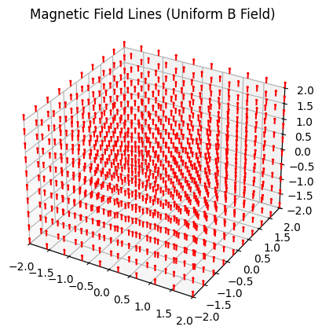

# Electromagnetism

## Problem 1: Simulating the Effects of the Lorentz Force

### Motivation
The Lorentz force, expressed as

$$
\mathbf{F} = q(\mathbf{E} + \mathbf{v} \times \mathbf{B})
$$

governs the motion of charged particles in electric and magnetic fields. It is foundational in fields like plasma physics, particle accelerators, and astrophysics. Simulations allow us to explore and visualize the complex trajectories that arise from this force.

---

### Task

#### 1. Exploration of Applications
- Identify systems where the Lorentz force plays a key role (e.g., particle accelerators, mass spectrometers, plasma confinement).
- Discuss the role of electric (\(\mathbf{E}\)) and magnetic (\(\mathbf{B}\)) fields in controlling particle motion.

#### 2. Simulating Particle Motion
- Implement simulations for charged particles under:
  - Uniform magnetic field.
  - Combined uniform electric and magnetic fields.
  - Crossed electric and magnetic fields.
- Simulate circular, helical, or drift motions based on initial conditions and field setup.

#### 3. Parameter Exploration
- Vary:
  - Field strengths (\(\mathbf{E}\), \(\mathbf{B}\))
  - Initial velocity \(\mathbf{v_0}\)
  - Particle charge \(q\) and mass \(m\)
- Observe how these affect the trajectory.

#### 4. Visualization
- Create clear 2D and 3D plots showing particle paths.
- Highlight phenomena like the Larmor radius and drift velocity.

---

### Python Simulation Script

### Field Lines Visualization" and depicts the magnetic field lines in a three-dimensional space.
This visualization aims to illustrate the structure of a magnetic field across a region of space. Specifically, it shows the direction and uniformity of the magnetic field vectors in a 3D grid, giving an intuitive understanding of how the magnetic field extends through space.

