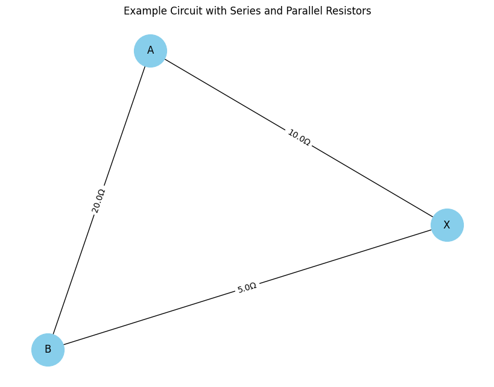

# Problem 1
# Problem 1: Equivalent Resistance Using Graph Theory

## 💡 Motivation

Calculating equivalent resistance is a fundamental problem in electrical circuits, essential for understanding and designing efficient systems. While traditional methods involve applying series and parallel resistor rules, these become cumbersome in complex circuits. Graph theory provides a powerful alternative by representing circuits as graphs, enabling structured, algorithmic analysis.

Nodes represent junctions, and edges represent resistors with weights equal to resistance values. This approach not only simplifies analysis but is foundational in circuit simulation, optimization, and network design tools.

Graph-theoretic methods illustrate the deep connections between mathematics, physics, and engineering, offering valuable insights and automation potential.

---

## 🔹 Option 1: Simplified Task – Algorithm Description

### 🔄 Algorithm Overview

The goal is to reduce a resistor network graph to a single equivalent resistance between two nodes.

1. **Identify series connections:**

   * If a node connects to exactly two others and is not a terminal node, merge the two resistors into one:
     $R_{eq} = R_1 + R_2$

2. **Identify parallel connections:**

   * If two nodes are connected by multiple resistors (i.e., multiple edges), replace them by a single resistor:
     $\frac{1}{R_{eq}} = \sum \frac{1}{R_i}$

3. **Iteratively reduce the graph:**

   * Apply series and parallel rules until only two nodes remain with one edge.

### 🤧 Pseudocode

```pseudo
function simplify_circuit(graph, node_start, node_end):
    while number_of_nodes(graph) > 2:
        for each node in graph:
            if is_series_node(node):
                merge_series(node)
            if has_parallel_edges(node):
                merge_parallel(node)
    return edge_weight(node_start, node_end)

function is_series_node(node):
    return degree(node) == 2 and node not in [start, end]

function merge_series(node):
    neighbors = get_neighbors(node)
    R1 = get_edge_weight(neighbors[0], node)
    R2 = get_edge_weight(neighbors[1], node)
    R_eq = R1 + R2
    remove_node(node)
    add_edge(neighbors[0], neighbors[1], weight=R_eq)

function merge_parallel(node):
    for each pair of parallel edges:
        compute 1 / R_eq = sum(1 / R_i)
        replace with one edge of weight R_eq
```



## 🎓 Example Configurations

1. **Simple Series:** A–10Ω–B–5Ω–C → Total: 15Ω
2. **Parallel:** A–10Ω–B, A–5Ω–B → Total: $1 / R = 1/10 + 1/5 → R = 3.33Ω$
3. **Nested:** Series and parallel mixed: A–\[X(10Ω)–Y(5Ω)] in parallel with A–15Ω–Y

---

## 📊 Efficiency & Improvements

* **Current method**: Iteratively searches and simplifies.
* **Time complexity**: O(n²) worst case due to traversal and edge checking.
* **Potential improvements**:

  * Use Union-Find to track components.
  * Optimize detection of patterns using DFS.
  * Apply Kirchhoff’s matrix-based method for general cases.

---

## 📆 Deliverables

* Full implementation in Python using `networkx`.
* Example simulations and tests.
* Pseudocode and algorithm description.
* Efficiency analysis and suggestions for further enhancement.
