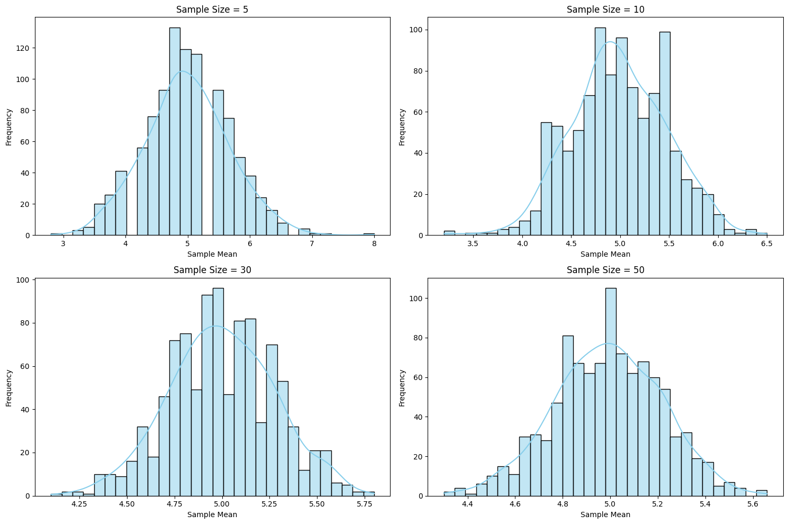

# Problem 1
# Exploring the Central Limit Theorem through Simulations

---

## Motivation

The Central Limit Theorem (CLT) is a cornerstone of probability and statistics, stating that the sampling distribution of the sample mean approaches a normal distribution as the sample size increases, regardless of the population’s original distribution. Simulations provide an intuitive and hands-on way to observe this phenomenon in action.

---

## Task

### 1. Simulating Sampling Distributions

- Select several types of population distributions, such as:
  - Uniform distribution
  - Exponential distribution
  - Binomial distribution
- For each distribution, generate a large dataset representing the population.

### 2. Sampling and Visualization

- Randomly sample data from the population and calculate the sample mean for different sample sizes (e.g., 5, 10, 30, 50).
- Repeat the process multiple times to create a sampling distribution of the sample mean.
- Plot histograms of the sample means for each sample size and observe the convergence to a normal distribution.

### 3. Parameter Exploration

- Investigate how the shape of the original distribution and the sample size influence the rate of convergence to normality.
- Highlight the impact of the population’s variance on the spread of the sampling distribution.

### 4. Practical Applications

- Reflect on the importance of the CLT in real-world scenarios, such as:
  - Estimating population parameters
  - Quality control in manufacturing
  - Predicting outcomes in financial models

---

## Deliverables

- A Markdown document and Python scripts or notebooks implementing the simulations for various population distributions.
- Plots illustrating the sampling distributions and their progression toward normality.
- A discussion on the implications of the results and their connection to theoretical expectations.

---

## Hints and Resources

- Use Python libraries such as NumPy for random number generation and Matplotlib/Seaborn for visualization.
- Begin with simple populations (e.g., uniform or normal) before exploring more complex distributions.
- Ensure understanding of how to calculate and interpret the sample mean and variance.
- This task encourages exploration of the Central Limit Theorem through computational experiments, deepening understanding of its significance in statistics.

---

## Example Python Code to Simulate CLT

