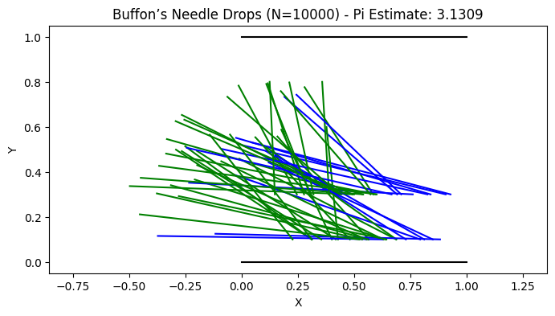
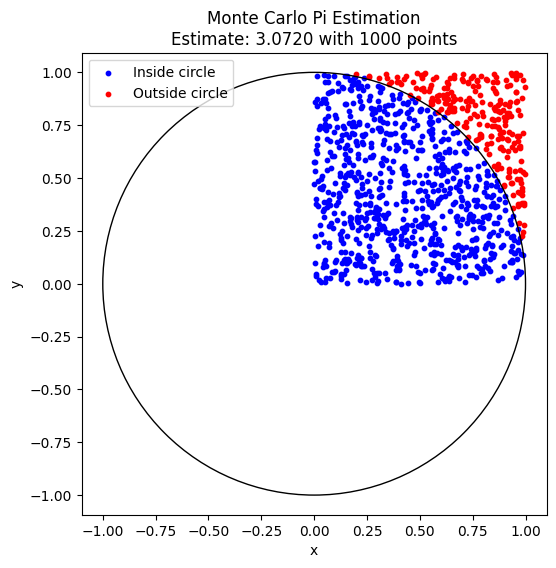
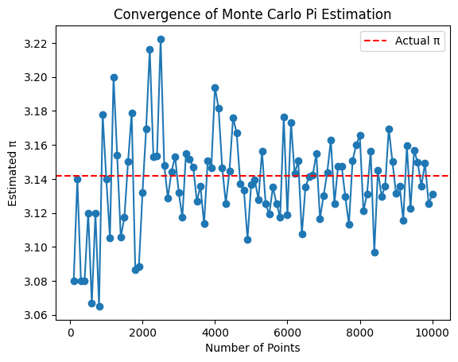
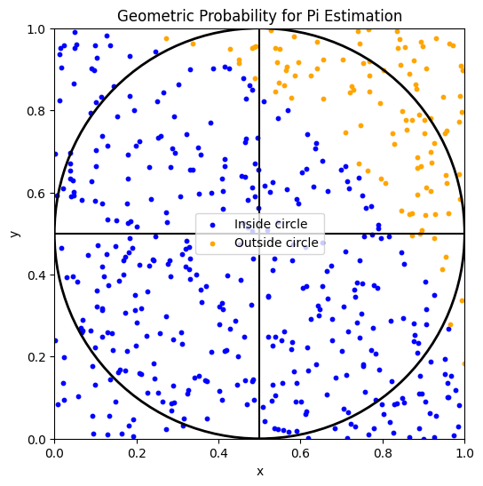

# Problem 2
# Estimating Pi Using Monte Carlo Methods

---

## Introduction

Monte Carlo methods use randomness to solve problems or estimate values.  
A classic application is estimating π through geometric probability.

---

## Part 1: Estimating π Using a Circle

### 1. Theoretical Foundation

- Consider a square of side 2, centered at the origin, with coordinates from -1 to 1.
- Inside, inscribe a circle of radius 1.
- When points are uniformly randomly generated within the square:

$$
P_{inside} = \frac{\text{Area of circle}}{\text{Area of square}} = \frac{\pi \times 1^2}{4} = \frac{\pi}{4}
$$

- Therefore, the estimate of π:

$$
\pi \approx 4 \times \frac{\text{Number of points inside}}{\text{Total number of points}}
$$

---

### 2. Simulation Approach

- Generate \(N\) random points in \([-1, 1]\) for both x and y.
- Count how many fall inside the circle, i.e., satisfy \(x^2 + y^2 \leq 1\).
- Compute the estimate:

$$
\pi \approx 4 \times \frac{M}{N}
$$

---

### 3. Visualization

- Plot all points:
  - Inside the circle: one color (e.g., blue)
  - Outside the circle: another color (e.g., red)
- Draw the circle boundary for reference.

---

### 4. Analysis

- As \(N\) increases, the estimate converges to the true π.
- Convergence rate is approximately \(O(1/\sqrt{N})\).
- Computational complexity is linear in the number of points, \(O(N)\).

---

## Part 2: Estimating π Using Buffon’s Needle

### 1. Theoretical Background

- Parallel lines spaced \(d\) units apart.
- Drop a needle of length \(L \leq d\) randomly.
- Probability that the needle crosses a line:

$$
P = \frac{2L}{\pi d}
$$

- Rearranged to estimate π:

$$
\pi = \frac{2L}{d P}
$$

- For simplicity, set \(L = d = 1\):

$$
\pi \approx \frac{2}{P}
$$

---

### 2. Simulation Approach

- Randomly generate:
  - Needle center position \(x_{center}\) uniformly in \([0, d/2]\).
  - Angle \(\theta\) uniformly in \([0, \pi/2]\).
- Check crossing condition:

$$
\text{Crosses} \quad \iff \quad \sin(\theta) \times \frac{L}{2} \geq x_{center}
$$

- Estimate π:

$$
\pi \approx \frac{2L \times N}{d \times C}
$$

where \(C\) is the number of crossings.

---

### 3. Visualization

### Circle Method (Buffon needle method)

2. Basic Monte Carlo Estimation of Pi with Scatter Plot
This script randomly generates points in a square and counts how many fall inside the inscribed circle, estimating π.

3. Plotting Convergence of Pi Estimate Over Number of Points
This script runs the simulation multiple times and plots how the estimate approaches π as the number of points increases.

4. Visualizing the Geometric Interpretation
This script draws the square and inscribed circle, showing a subset of points to illustrate the geometric probability.

