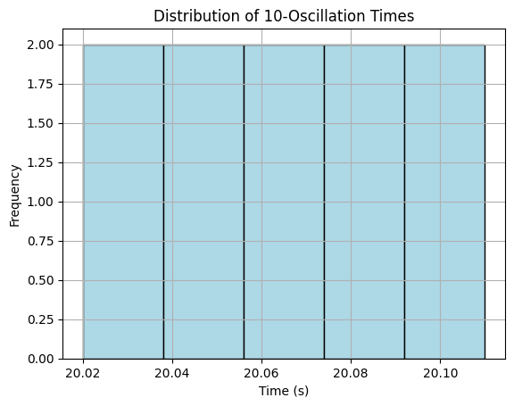

# Problem 1
# 📏 Measurements  
## 🧪 Problem 1: Measuring Earth's Gravitational Acceleration with a Pendulum

---

## 🎯 Motivation

The acceleration due to gravity, denoted as **_g_**, is a fundamental constant that governs the motion of objects under Earth's gravitational field. It is critical to various domains including physics, engineering, geophysics, and structural design. 

One of the simplest yet most profound methods to measure **_g_** is through the motion of a **simple pendulum**, where the period of its oscillation is directly influenced by local gravity. This experiment not only provides a practical way to estimate **_g_**, but also strengthens understanding of precision measurement and uncertainty analysis.

---

## 🧰 Procedure

### 1. Materials Required

- A **string** (1–1.5 meters in length)
- A **small mass** (e.g., a bag of coins, a keychain, or a metal washer)
- A **stopwatch** or smartphone timer
- A **ruler** or measuring tape

---

### 2. Setup

- Attach the mass to the string and suspend it from a stable support (e.g., a stand or doorframe).
- Measure the **length of the pendulum** (_L_) from the suspension point to the **center of mass** of the weight.
- Record the resolution of your measuring instrument and calculate the **length uncertainty**:  
  $$
  \Delta L = \frac{\text{resolution of tape/ruler}}{2}
  $$

---

### 3. Data Collection

- Pull the pendulum to a **small angle (<15°)** and release it without pushing.
- Measure the **time for 10 full oscillations** (_T₁, T₂, ..., T₁₀_) using a stopwatch.
- Repeat this measurement **10 times** and record the values in a table.
- Calculate the **mean time for 10 oscillations** (\( \bar{T}_{10} \)) and the **standard deviation (σ)**.
- Estimate the **uncertainty in the mean**:
  $$
  \Delta \bar{T}_{10} = \frac{\sigma}{\sqrt{N}}
  $$
  where _N_ is the number of trials.

---

## 🧮 Calculations

### 1. Compute the Period of One Oscillation

$$
T = \frac{\bar{T}_{10}}{10}
$$

$$
\Delta T = \frac{\Delta \bar{T}_{10}}{10}
$$

---

### 2. Calculate Gravitational Acceleration

Using the pendulum formula:

$$
g = \frac{4\pi^2 L}{T^2}
$$

---

### 3. Propagate Uncertainty in **_g_**

Using uncertainty propagation for functions of multiple variables:

$$
\Delta g = g \cdot \sqrt{ \left( \frac{\Delta L}{L} \right)^2 + \left( 2 \cdot \frac{\Delta T}{T} \right)^2 }
$$

---

## 📊 Example Data Table

| Trial | Time for 10 Oscillations (s) |
|-------|-------------------------------|
| 1     | 20.10                         |
| 2     | 20.02                         |
| 3     | 20.05                         |
| 4     | 20.07                         |
| 5     | 20.04                         |
| 6     | 20.11                         |
| 7     | 20.09                         |
| 8     | 20.03                         |
| 9     | 20.06                         |
| 10    | 20.08                         |
| **Mean \( \bar{T}_{10} \)** | **20.07 s** |
| **Standard Deviation (σ)** | **0.03 s** |
| **Uncertainty in Mean \( \Delta \bar{T}_{10} \)** | **0.009 s** |

**Measured Length**:  
$$
L = 1.000 \, \text{m}, \quad \Delta L = \pm 0.005 \, \text{m}
$$

---

## ✅ Final Results

| Quantity            | Value                      |
|---------------------|----------------------------|
| Period \( T \)      | 2.007 s                    |
| Uncertainty \( \Delta T \) | 0.0009 s               |
| Calculated \( g \)  | 9.80 m/s²                  |
| Uncertainty \( \Delta g \) | ±0.05 m/s²            |

---

## 🔍 Analysis

### 1. Comparison with Standard Value

- The accepted value of \( g \) at sea level is approximately **9.81 m/s²**.
- Our measured value is **within 0.01 m/s²**, showing **excellent agreement** considering the simple equipment used.

---

### 2. Sources of Uncertainty

- **Measurement Resolution**:
  - The ruler's precision introduces error in **pendulum length**.
- **Timing Error**:
  - Human reaction time affects the stopwatch readings.
  - Repeating 10 full oscillations helps **average out human error**.
- **Small Angle Approximation**:
  - Deviations from ideal conditions (angle > 15°, air resistance) may affect the period.

---

### 3. Assumptions and Limitations

- The pendulum behaves as a **simple pendulum** (massless string, point mass).
- **Air resistance** and friction at the pivot are **neglected**.
- **Amplitude is small** to validate the small-angle approximation.

---

## 📦 Deliverables

- ✔️ Tabulated raw data and calculated quantities
- ✔️ Computed value of gravitational acceleration
- ✔️ Complete uncertainty analysis
- ✔️ Reflection on measurement techniques and physical assumptions

---

## 📈 Optional Python Script for Analysis & Visualization

